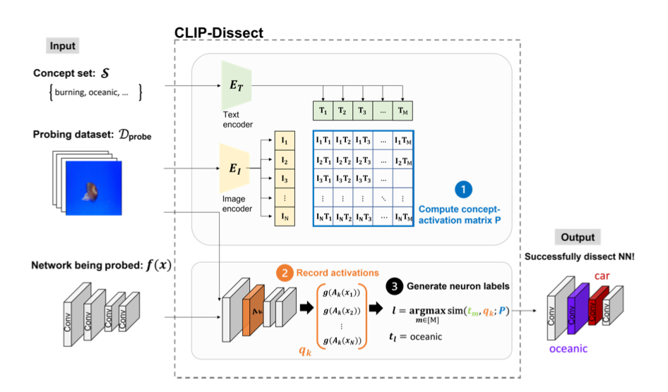
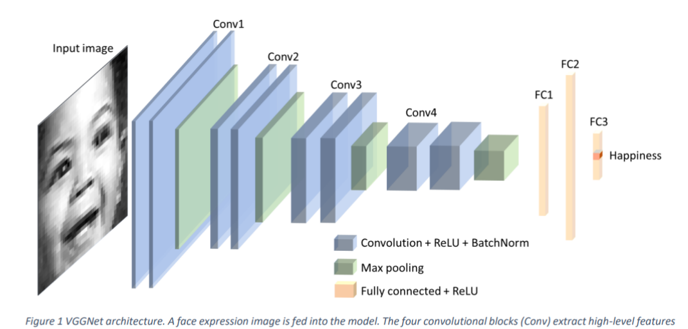
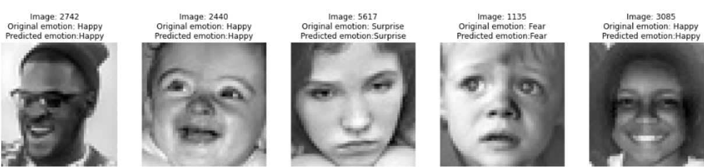
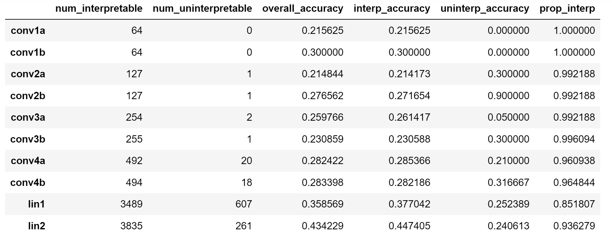

# Enhancing Emotion Recognition in AI: A CLIP-Dissect Approach

## Section B01: Robust and Interpretable Neural Network Models for Computer Vision and Natural Language Processing
### Joon Cha, Sungjin Choi, Jasmine Lo, Hieu Luu
### Mentor: Lily Weng

## Introduction

Our project looks at how interpreting neural networks can make image emotion recognition systems better. Currently, the best method to classify emotions based on an image is with deep learning, a rapidly growing field with state of the art performance in visual tasks. However, it is unclear what is happening within deep learning models that leads to such strong performance, often being nicknamed a “black box.” We aim to extend Dr. Weng's project for emotion detection by leveraging CLIP-Dissect's ability to annotate internal neurons with ambiguous concepts.  With the development of CLIP-Dissect, which can easily interpret the role of deep neural network neurons, we seek to understand how a model classifies emotions, what biases there are, and how to improve it

#### What exactly is CLIP-Dissect?
Technique to analyze neurons in intermediate layers inside a vision network. It inputs a deep neural network (DNN) to be dissected/probed, a set of probing images, and a set of concepts, and outputs neuron labels. 

## Data

### Probing Dataset
The FER2013 dataset is a comprehensive collection of facial expression images, pivotal for advancing research in emotion recognition. This dataset comprises approximately 30,000 grayscale images, each standardized to a resolution of 48x48 pixels. These images encapsulate the complexity and variance inherent in human facial expressions, making it an invaluable resource for training and evaluating machine learning models in the field of computer vision and affective computing.

- FER2013
  - Description: The data consists of 48x48 pixel grayscale images of faces. The faces have been automatically registered so that the face is more or less centered and occupies about the same amount of space in each image.
  - Task: Categorize each face based on the emotion shown in the facial expression into
  one of seven categories (0=Angry, 1=Disgust, 2=Fear, 3=Happy, 4=Sad, 5=Surprise, 6=Neutral).
  - Training Set: 28,709 examples.
  - Public Test Set: 3,589 examples.
  - Link: [FER2013](https://www.kaggle.com/datasets/msambare/fer2013)

### Concept Sets
Two concept sets were used: (1) the seven expression categories as above, and (2) a facial expression emotion concept set with twenty five concepts created with GPT-4 and based on those seven emotions.

- FER2013 Classes
    - number of concepts: 7
 
- Facial Expressions
    - number of concepts: 27

## Methods

In our project, we employed a comprehensive approach to understand and interpret facial expressions through machine learning models, focusing on the Facial Expression Recognition 2013 (FER-2013) dataset. The methodology involved several key steps, beginning with obtaining a baseline model, analyzing important features for emotion through dissection, and modifying the network. The baseline model we used is a VGGNet architecture trained on FER2013, with a test accuracy of 69.42%. We seek to analyze the features being used in the model to understand how the model works. Our goal with modifying the network is to improve accuracy.

#### Model Architecture (VGGnet)

#### Project Procedure I: Emotion Feature Analysis

1. Generate and label our new concept set with GPT4
2. Apply CLIP-Dissect with same d-probe and probing images, but with   the new concept set
3. Taking only the results that were predicted accurate, count the sampled concepts that were used
4. Visualize and analyze the neurons/concepts

#### Project Procedure II: Network Dissection and Modification 

1. As part of the network dissection performed in procedure I, we obtain the max similarity value between each neuron activation and concept label. 
2. We choose the similarity cutoff tau = 0 to determine the set of interpretable neurons. We then choose the layer with the most interpretable neurons to modify.
3. To modify the layer, we multiply the interpretable neuron weights by 1.5 and divide the uninterpretable neuron weights by 1.5.
4. After modifying the layer weights, we re-evaluate the model on the test data.

## Results

#### Part I: Neuron Dissection and Modification

We analyzed neurons in the lin2 layer of a VGG-like network to distinguish between interpretable and uninterpretable ones based on the sum of absolute values of their weights. Using 0.0 as the similarity cutoff, we identified neurons above this threshold as interpretable and those below as uninterpretable. We modified the weights by multiplying those of interpretable neurons and dividing those of uninterpretable neurons by a factor of 1.5. This modification resulted in a slight increase in model accuracy (about 0.21%), demonstrating that such targeted weight adjustments can potentially influence model performance.

Example Predicted Images:

Layer Accuracies:

#### Part II:  Emotion Feature Analysis with Neural Network Dissection

We were able to use VGGnet and apply CLIP-dissect. After the application, we generated another concept set that includes more detailed facial expression for further analysis of how our machine makes its decision. Taking a portion of sample from dissected lin2 layer with 4096 neurons, we picked only the facial expression that were predicted correct and get results as the visualization below.  

## Discussion

We analyzed the dissected neuron labels with emotion concept sets generated by GPT-4. From 4096 neurons, we filtered out the correct predictions made by the model, and we were able to get distribution of facial expressions. Concepts such as “Wide Open Eyes” recorded the highest percentage with 19.4%, suggesting that such concept is effective for our model to predict “surprise”.  We visualized horizontal bar graph to show the distribution of facial expressions in descending order. 

The classified and more interpretable emotions from computer vision could be dangerous on some points. One of our concerns was potential threats for privacy due to better recognition of face. On the other side, we do believe that the improved models and interpretation could lead to development on virtual therapy, and education purposes for people with facial/emotion recognition disorders.

## Conclusion

Using CLIP-Dissect we identified which neurons played key roles in predicting image classification. Through measuring interpretability at each intermediate level neuron, we chose which weights to update to increase the accuracy of model. In our model, “good” neurons’ weights were multiplied by a factor of 1.5 and “bad” neurons’ weights were divided by a factor of 1.5. This increased the model accuracy from 69.420% to 69.629%.

## References
